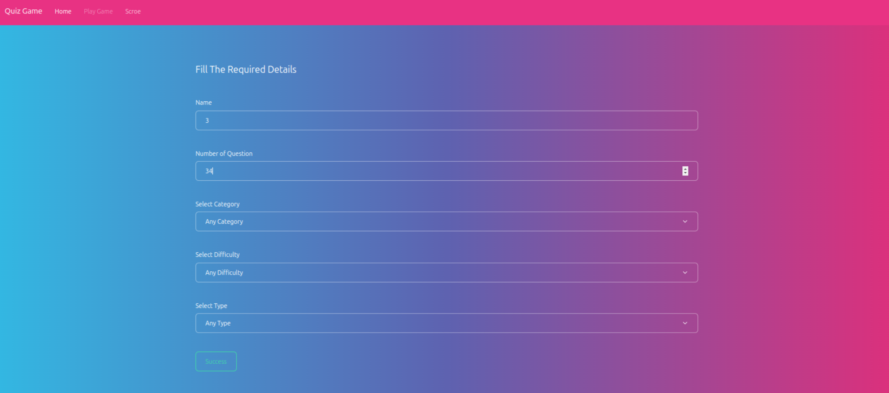
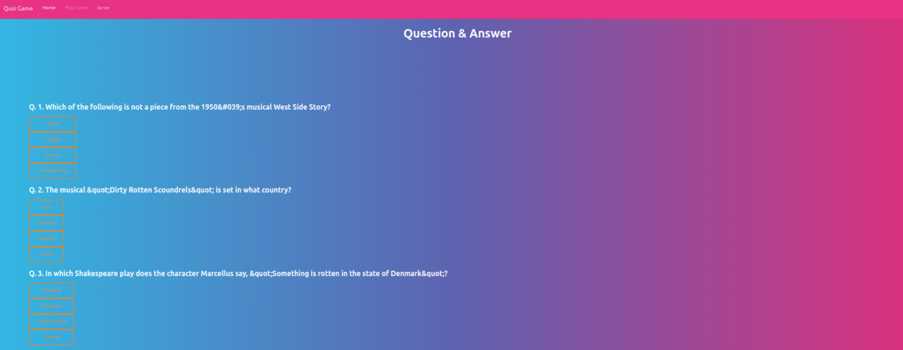

# Basic Quiz Game 
---

## it is Devid into three Section

* Select Quiz type.

* Perform the Quiz.

* See the Result.

---

## Select Quiz type

* Select Quiz type from the dropdown.

* Select the number of questions.

* Select the difficulty level.

* Select the category.
* Click on the Start Quiz button to start the quiz.

---

## Perform the Quiz

* Showing the all questions one by one.

* click the submit and get the result.

---

